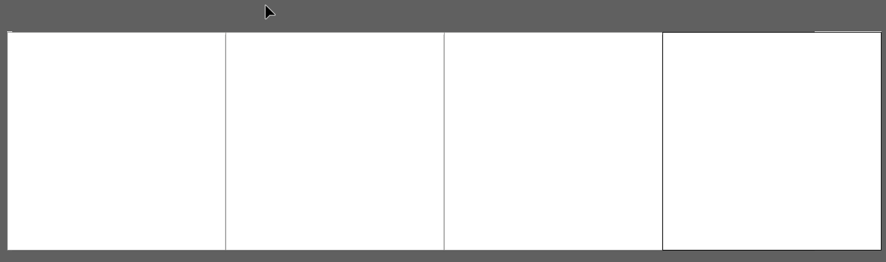
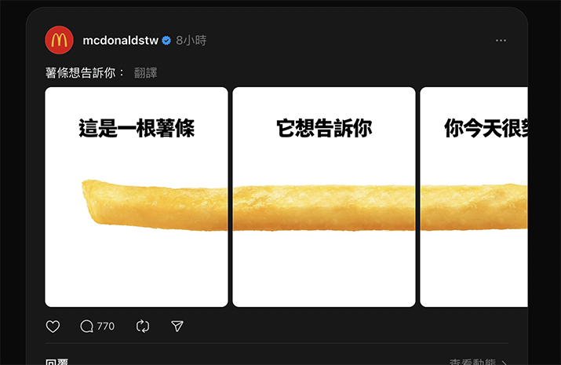

# IG/Threads 社群輪播效果製作

Illustrator 開新檔案
- 寬度 / 高度 都相同 （例如：1080)，單位選 像素。
- 工作畫板數量可以調高，例如 4 就是可以有四張圖，想要多一點則增加數量。
- 出血全部選 0 。
- 色彩模式：螢幕用建議選 RGB 色彩。
- 點陣特效：選螢幕（72ppi）。
其他不用更動，按下建立。

按選單上的視窗→工作區域。

按下工作區域視窗左下角，類似 Z 形符號（重新排列所有工作區域順序）。

按下 → （依橫欄排列順序），間距調整成 0 ，按下確定。
工作區域就會呈現下圖：

將連續的圖，橫跨 4 個工作區域，再輸出圖片，發布至社群就可以產生滑動有輪播感的貼文
就像[麥當勞脆文](https://www.threads.net/@mcdonaldstw/post/DBK7t6evWtU?xmt=AQGzKXlSgUBm9Snipytc4wTW_40p5X316IDxXiOzGMpZiw)：

例如麥當勞貼文裡的文字，除了就地貼上( <kbd>shift</kbd> + ctrl + v / )，但要每個工作區域都進行一遍。

可以使用選單中編輯 → **在所有工作區域上貼上** ( alt + shift + ctrl + v / Option + Shift + Command + V )
