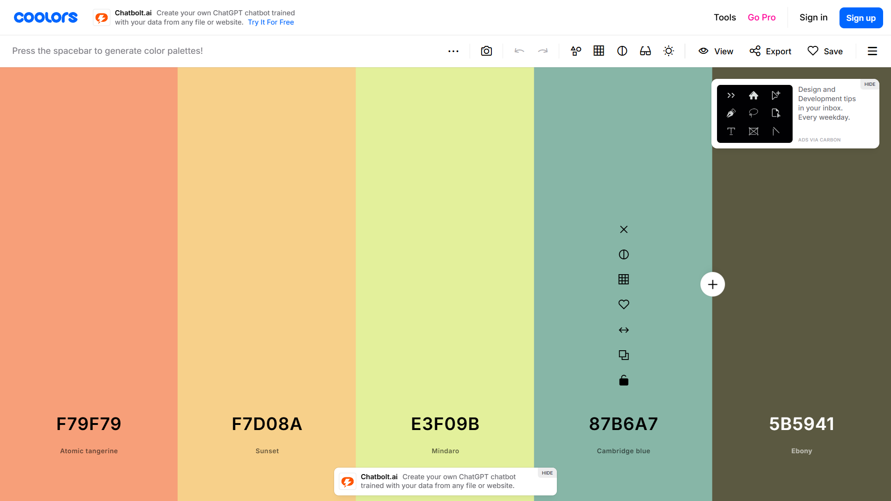

# 數位影像處理資源

## Brand identity guidelines Template
~~<a href="">asdfasf</a>[^2]~~ 
<a href="brand-manual-template-design.zip">Brand manual Template</a>[^3] 
~~[^2]:source: <https://www.behance.net/gallery/88198917/Free-Brand-identity-guidelines-template>~~
[^3]:source: <https://www.freepik.com/free-vector/brand-manual-template-design_33758371.htm#fromView=search&page=1&position=18&uuid=0681baf2-3bc3-4580-8943-11ef5b8be401>
## 名片 mockup 檔下載：
<a href="https://dip.project.solmag.tw/mockup-businesscard.zip" download>名片mockup</a>[^1]

<a href="https://dip.project.solmag.tw/i/cloud.png" download>雲朵練習檔下載</a>
### 社群圖片類輪播效果

## [字體資源](font-resources.md)
~~<a href="https://dip.project.solmag.tw/i/newjeans.png" download>練習檔</a>~~
~~<a href="https://dip.project.solmag.tw/layer.psd" download>layer 範例 PSD</a>~~
---
[^1]:source: <https://www.freeimages.com/psd/realistic-business-card-mockup-5463381>
---
配色網站

[Coolors.co](https://coolors.co/generate)
每次都會產生五個顏色的配色，缺顏色搭配可使用

[NIPPON COLORS](https://nipponcolors.com/)
NIPPON COLORS 日本色的配色網站，一樣缺顏色搭配的可以使用

[Colour Contrast Checker](https://colourcontrast.cc/)

