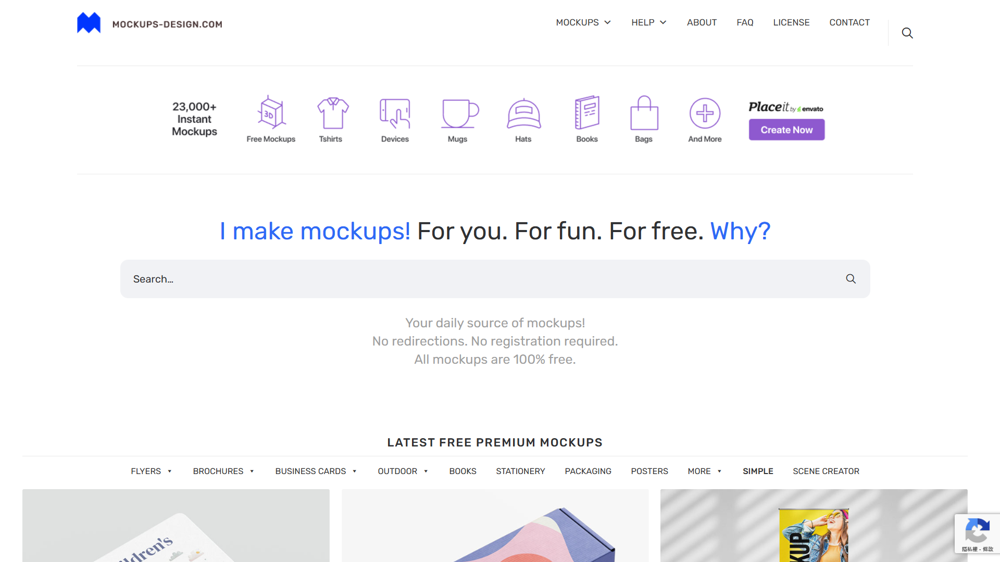
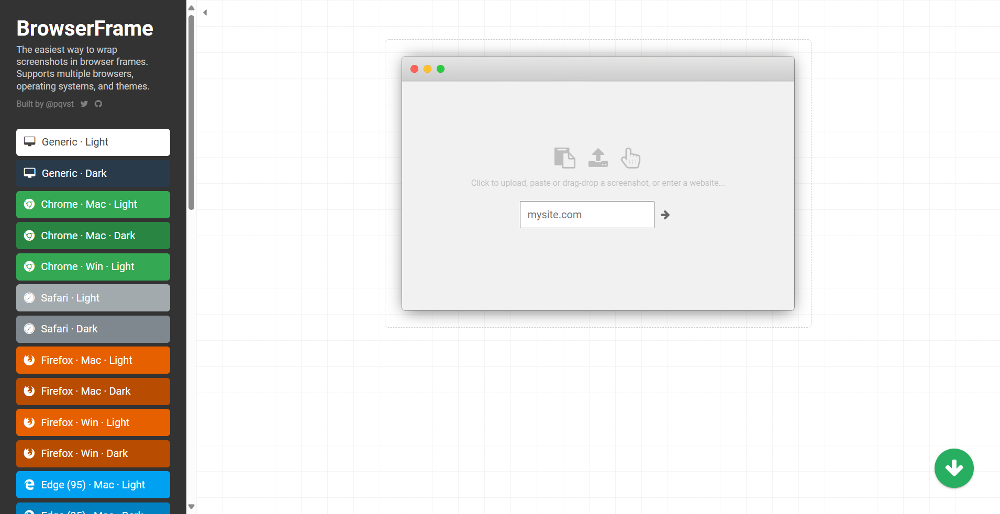
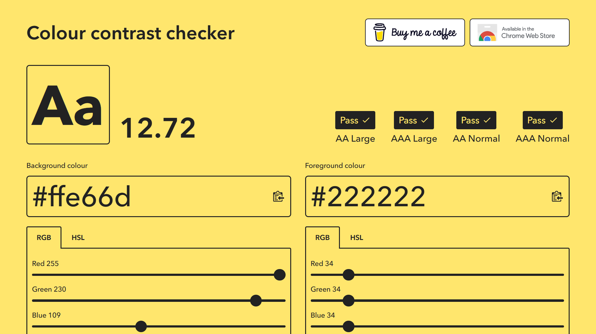

# 數位影像處理資源
## Free Mockup 網站
[mockups-design](https://mockups-design.com)

## AI 指令檔輸出色碼 (renderSwatchLegend)
- [點此下載](https://raw.githubusercontent.com/seraphwu/dip/main/assets/renderSwatchLegend.jsx.zip)

安裝方式：
下載解壓縮，取得 renderSwatchLegend.jsx，複製貼上至以下位置(繁體中文)：
- Windows:
  C:\Program Files\Adobe\Illustrator\Presets\zh_TW\Scripts
- Mac:
  /Applications/Illustrator/Presets/zh_TW/Scripts

## 替截圖加上瀏覽器邊框
[BrowserFrame | Wrap screenshots in browser frames](https://browserframe.com/)

## Brand identity guidelines Template

- [Brand-identity-guidelines.zip](https://raw.githubusercontent.com/seraphwu/dip/main/Brand-identity-guidelines.zip)[^2]
- [brand-manual-template-design.zip](https://raw.githubusercontent.com/seraphwu/dip/main/brand-manual-template-design.zip)[^3]
[^2]:source: <https://www.behance.net/gallery/88198917/Free-Brand-identity-guidelines-template>
[^3]:source: <https://www.freepik.com/free-vector/brand-manual-template-design_33758371.htm#fromView=search&page=1&position=18&uuid=0681baf2-3bc3-4580-8943-11ef5b8be401>
## 名片 mockup 檔下載：
- <a href="https://dip.project.solmag.tw/mockup-businesscard.zip" download>名片mockup</a>[^1]
- <a href="https://raw.githubusercontent.com/seraphwu/dip/main/i/cloud.png" download>雲朵練習檔下載</a>
### [社群圖片類輪播效果](Carousel.md)

## [字體資源](font-resources.md)
~~<a href="https://dip.project.solmag.tw/i/newjeans.png" download>練習檔</a>~~
~~<a href="https://dip.project.solmag.tw/layer.psd" download>layer 範例 PSD</a>~~
---
[^1]:source: <https://www.freeimages.com/psd/realistic-business-card-mockup-5463381>
---
配色網站

[Coolors.co](https://coolors.co/generate)
每次都會產生五個顏色的配色，缺顏色搭配可使用

[NIPPON COLORS](https://nipponcolors.com/)
NIPPON COLORS 日本色的配色網站，一樣缺顏色搭配的可以使用

[Colour Contrast Checker](https://colourcontrast.cc/)

